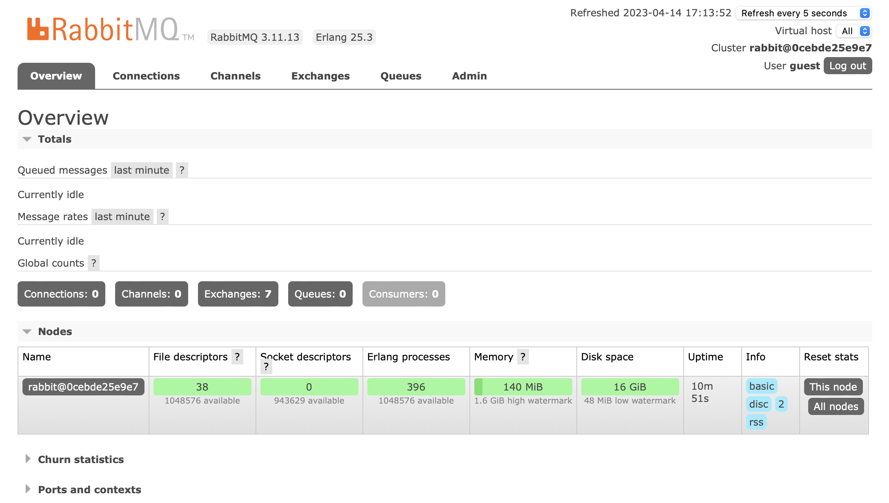

# 1.Rabbit MQ Env
***

## Env Setting

1. Rabbit MQ docker 실행하기

```
docker run -d --name rabbitmq -p 5672:5672 -p 15672:15672 -p 1883:1883 -e RABBITMQ_DEFAULT_USER=user -e RABBITMQ_DEFAULT_PASS=password rabbitmq:3-management
```
각각의 포트가 의미하는것들은 아래와 같다
|포트|의미|
|:---:|:---:|
|5672|AMQP|
|15672|http(웹 관리 콘솔)|
|15692|http(Prometheus)|
|4369|EPMD(Erlang Port Mapper Daemon)|
|1883|MQTT 접속포트|
|25672|Multi Node Clustering|

`AMQP`란 Advanced Message Queue Protocol의 약자이다. 대부분의 Open Source Message Queue들은 이 프로토콜을 따른다.


2. 관리콘솔 접속해보기

```
http://localhost:15672
```
만약 Rabbit MQ컨테이너 실행시 `RABBITMQ_DEFAULT_USER`와 `RABBITMQ_DEFAULT_PASS`를 설정하지 않았다면 초기 비밀번호는 `guest/guest`이다.

