# 3. Worker Queue
***

## Worker Queue

앞에서 기본적인 단일 `Producer`, `Consumer`, `Queue`를 활용하여 메세지 송수신을 작성해 보았다. 이번에는 `Worker Queue`라는 것을 작성해 볼 것이다. `Worker Queue`란 시간이 오래 걸리는 작업을 여러개의 `Worker`(Consumer)에 분배하는것을 의미한다.


`Worker Queue`는 짧은 요청기간동안 복잡한 작업을 처리하지 못하는 웹 애플리케이션 프로그램에 적절하다.

## 실험 준비

[Source Code : src/WorkerQueue](../src/WorkerQueue/)

실험 준비에 앞서 기존에 작성한 코드에 변화를 주고자 한다. `Worker Queue`는 결국 시간이 오래 걸리는 작업에 대해 관찰해야 하기 때문에 `setTimeout()`함수를 활용하여 latency를 준다. latency는 인자로 전달하는 문자열 뒤에 오는 `'.'`개수 하나당 1초로 가정한다.

~~~
ex) "Hello World..." -> 3초
~~~

앞에서 작성한 코드를 재활용한다. `send.js`는 `new_task.js`로 파일명을 변경하였으며, 코드에서 변경한 부분만 아래 첨부한다. 가장 크게 변경된 점이라면 프로그램 실행시 가변인자를 주고, 
해당 내용을 메세지로 Queue에 전달하는 방식으로 변경되었다.

```JavaScript
// new_task.js

const producer = async () => {
  msg = process.argv.slice(2).join(' ') || 'Hello world';

  // Create Queue
  await channel.assertQueue(process.env.QUEUE_NAME, {
    durable: true
  })

  ...

  channel.sendToQueue(process.env.QUEUE_NAME, Buffer.from(msg), {
      persistent: true
  })

  ...
}
```

`receive.js`는 `worker.js`로 파일명을 변경하였으며, `worker.js`에서는 메세지에서 `'.'`의 개수만큼, 작업의 latency를 생성하는 로직을 작성한다. 위와 동일하게 변경된 부분만 첨부한다.

```JavaScript

...

    // Declare a Queue to send message
    await channel.assertQueue(process.env.QUEUE_NAME, {
      durable: true
    })
    
    await channel.consume(process.env.QUEUE_NAME, (msg) => {
      const seconds = msg.content.toString().split('.').length - 1
      console.log(`Recieved : ${msg.content.toString()}`)
      setTimeout(() => {
        console.log("Done!")
      },seconds * 1000);
    }, {
      noAck: true
    })  

...


```

## Round-Robin Dispatching

`Queue`를 활용했을때 장점중 하나는, 작업에 대해 병렬적인 처리가 가능하다는 것이다. 만약 작업이 많이 밀리거나 쌓인다면, `worker`를 추가해주기만 하면 된다. 즉, 하나의 `Queue`에 대해 `worker`들을 scale-out하기가 매우 용이하다.

이를 확인하기 위해서는 우선 `worker.js`를 서로 다른 tty 세션에서 두 개 실행해준다. 이렇게 되면 이 두 `worker`는 동일한 `Queue`에서 메세지를 받게 된다.

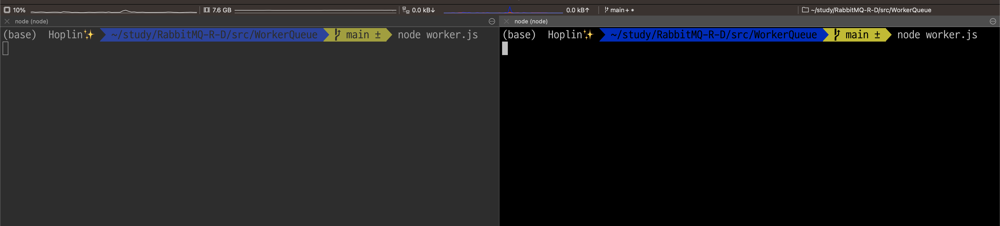

이 상태에서 아래와 같이 `new_task.js`를 활용하여 Queue에 메세지를 보내본다.

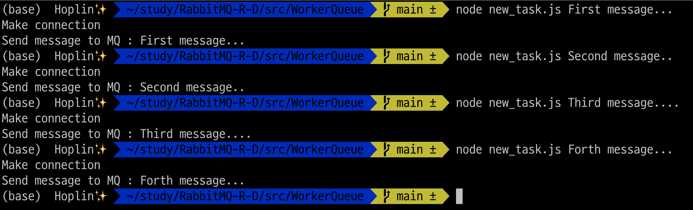

다시 `worker`들이 동작하는 tty 세션으로 돌아오면 서로 다른 두 `worker`가 하나씩 차례대로 메세지를 받는것을 볼 수 있다.

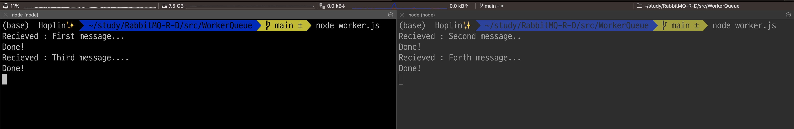

기본적으로 Rabbit MQ는 각각의 메세지를 순서대로 다음 `Consumer`(혹은 `Worker`)에게 넘겨준다.모든 `Consumer`들은 평균적으로 동일한 수의 메세지를 받게 되며, 메세지를 분산하는 방은 `Round-Robin` 방식을 사용하게 된다. `Round Robin` 방식이란  우선순위를 두지 않고, 순서대로 시간단위로 할당하는 방식의 알고리즘을 의미한다.(운영체제 스케줄러 회상하면된다.) 

조금 더 체감하고 싶은 경우 `worker`를 하나 더 실행 한 후 테스트해본다.

## Message Acknowledgment

가정을 하나 해본다. 만약 consumer가 데이터를 받은 후, 오랜 기간동안 처리한다고 가정한다. 하지만, worker가 처리하던 도중, 중단되었다고 가정한다. 어떻게 될까? 

일반적으로 Rabbit MQ가 `consumer`에게 메세지를 전달한 순간 해당 메세지는 삭제할 메세지로 지정된다. 앞에서 작성한 코드를 사용할때 위의 가정이 발생한다면, 해당 메세지는 그냥 없어지게 된다. 순수히 `consumer`에게 전달만 되고 데이터는 유실되게 되는것이다.

Rabbit MQ는 이러한 상황이 일어나는것을 방지하고자 `Message Acknowledgement`라는것을 지원한다. 이는 **`consumer`가 Rabbit MQ로 부터 데이터를 받은 후, 데이터의 처리까지 완료 한 후, 해당 데이터를 삭제해도 된다고 보내는 Acknowledge Message**이다.

만약 `consumer`가 `ack message`를 반환하지 않고, 중단되게 된다면 Rabbit MQ는 메세지가 정상적으로 처리되지 않았다고 인지한 후, 메세지를 Queue에 다시 Re-Enqueue 함으로서 데이터 유실을 방지한다(**Rabbit MQ의 Maximum Waiting Time은 30분이 기본값**이라고 한다.). 만약 해당 `Queue`에 연결된 `channel`을 가진 다른 `consumer`가 존재한다면, 해당 `consumer`에 메세지를 전달해준다.

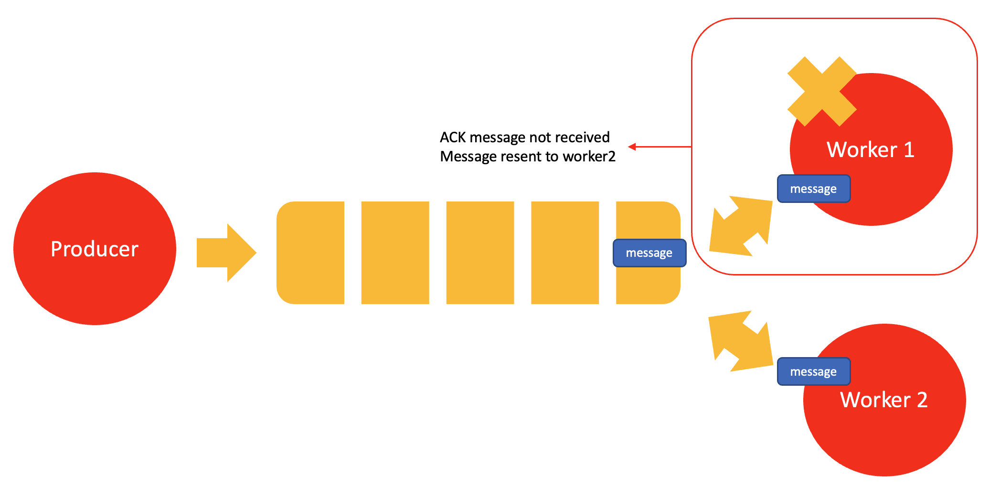

기본적으로 `ACK Message`옵션은 비활성화 되어있다. 이를 활성화 하기 위해서는 `channel.consume()`([Document](https://amqp-node.github.io/amqplib/channel_api.html#channel_consume)) 메소드의 옵션에 `{ noAck: false }`를 추가한다. 

데이터에 대한 작업 처리 하는 콜백함수(두번째 매개변수)에서 메세지에 대한 처리가 완료되면 **`channel.ack((전달받은 메세지 객체))`([Document](https://amqp-node.github.io/amqplib/channel_api.html#channel_ack))메소드를 사용하여 처리한 메세지에 대해 수신, 처리까지 완료한것을 Rabbit MQ에 `ACK Message`를 전송하여 알려주어야 한다**.(이 과정을 생략하면 Queue에서 데이터가 삭제되지 않는다.)

데이터에 대한 작업(두번째 매개변수로 전달되는 콜백함수)이 끝났을때 `ACK Message`를 전송한다.([Document](https://amqp-node.github.io/amqplib/channel_api.html#channel_consume))

```JavaScript
// worker.js
...

    await channel.consume(process.env.QUEUE_NAME, (msg) => {
      const seconds = msg.content.toString().split('.').length - 1
      console.log(`Recieved : ${msg.content.toString()}`)
      setTimeout(() => {
        console.log("Done!")
        // 중요!
        channel.ack(msg)
      },seconds * 1000);
    }, {
      noAck: false
    })

...
```

`ACK Message`는 메세지를 받은 동일한 채널에 전송해야한다. 만약 다른 채널에 전송하게 되면, 예외가 발생하게 된다.

이제 위 내용을 실험해 본다. `Round Robin Dispatching`실험할때와 동일하게 우선 `worker`를 두개 실행한다.

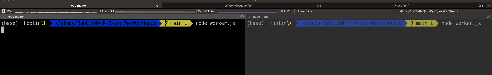

그 후 `new_task.js`를 실행한다. 문자열 뒤에 점을 여러개 찍어 긴 시간의 latency를 준다.

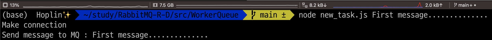

`worker`중 왼쪽 `worker`기 메세지를 받게 된다. 그 후 `Ctrl + C`를 누르면 오른쪽으로 메세지가 재전송되는것을 확인할 수 있다. 왼쪽의 `worker`를 다시 실행한 후 오른쪽의 `worker`를 종료하면 다시 왼쪽의 `worker`로 메세지가 넘어가는것을 볼 수 있다.

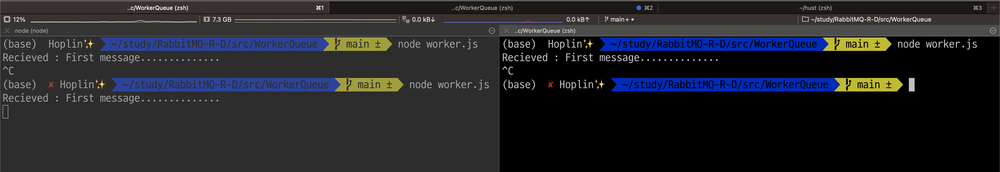

## Message Durability

앞에서 `Message Acknowledge`를 통해서 `consumer`가 멈추어도 메세지를 보존하는법에 대해 배웠다. 하지만, 만약 **Rabbit MQ 서버가 멈추게 된다면 이 방법은 전혀 소용없는 방법**이다.

기본적으로 Rabbit MQ가 멈추거나 오류가 발생하게 되면, 모든 `Queue`들과 `messages`들은 모두 유실되게 된다. 이러한 경우에 유실을 방지하기 위해서는 두가지 작업이 요구된다.

1. Queue를 정의하는 `channel`객체의 `assertQueue()` 메소드에 옵션으로 `{ durable: true }`를 추가해주어야 한다. 하지만 주의할 점이 있다.

- Rabbit MQ는 기존에 존재하던 `Queue`에 대해 옵션을 추가하여 재정의가 불가능하다. 앞에서 봤듯이 `Queue`는 `멱등성`이 있기 때문이다.

- `assertQueue()`메소드의 `durable`옵션은 `producer`, `consumer`가 동일한 값으로 설정되어있어야 한다. 만약 서로 다르게 정의가 되어있다면 아래와 같이 예외가 발생한다.

  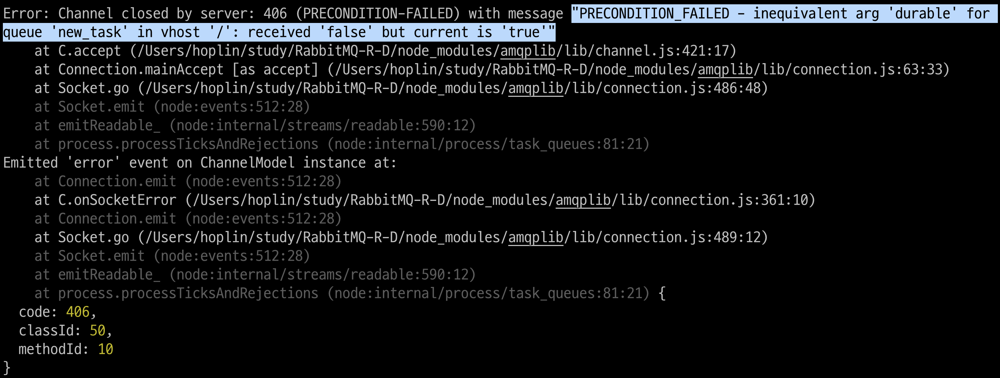

소스코드를 변경해 본다. `assertQueue()`메소드에  `Queue`의 이름을 변경하여 전달해 주어야 한다.(예시 코드에서는 `.env`파일의 `QUEUE_NAME` 필드 값을 변경하면 된다. 이 예시에서는 `Queue`의 이름을 `new_task`에서 `Durable_test`로 변경하였다.)

먼저 `new_task`를 실행한다. 그 후 Rabbit MQ Docker Container를 멈춘다

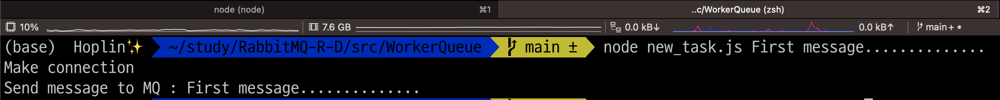

```
docker stop rabbitmq
```

그 후 다시 Rabbit MQ Docker Container를 시작한다.

```
docker start rabbitmq
```

그리고 나서 `worker`를 실행하면, `worker`가 `Queue`로부터 메세지를 받아오는것을 볼 수 있다.

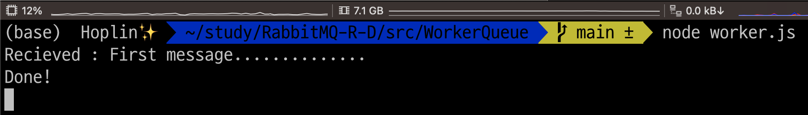

## Fair Dispatch

Rabbit MQ는 기본적으로 메세지를 모두 `worker`에게 전송하는 성질을 가지고 있다. 이로 인해 발생할 수 있는 문제점이 있다. 메세지에 따라 처리작업이 오래걸릴 수 도, 적게 걸릴 수 도 있다. 이로인해, `worker`별로 한가할 수 도 있으며, 바쁠 수 도 있다. 이는 결국 메세지 처리에 있어 비효율성을 가져온다.  Rabbit MQ는 이러한 점을 고려하지 않고, 지속적으로 `Queue`에 연결한 `worker`에 메세지를 전송한다. 아래 이미지를 보면 기존 메세지에 대한 처리가 완료되지 않았지만, `producer`가 전송한 메세지는 Rabbit MQ에 의해 계속 `worker`로 전송되게 된다.

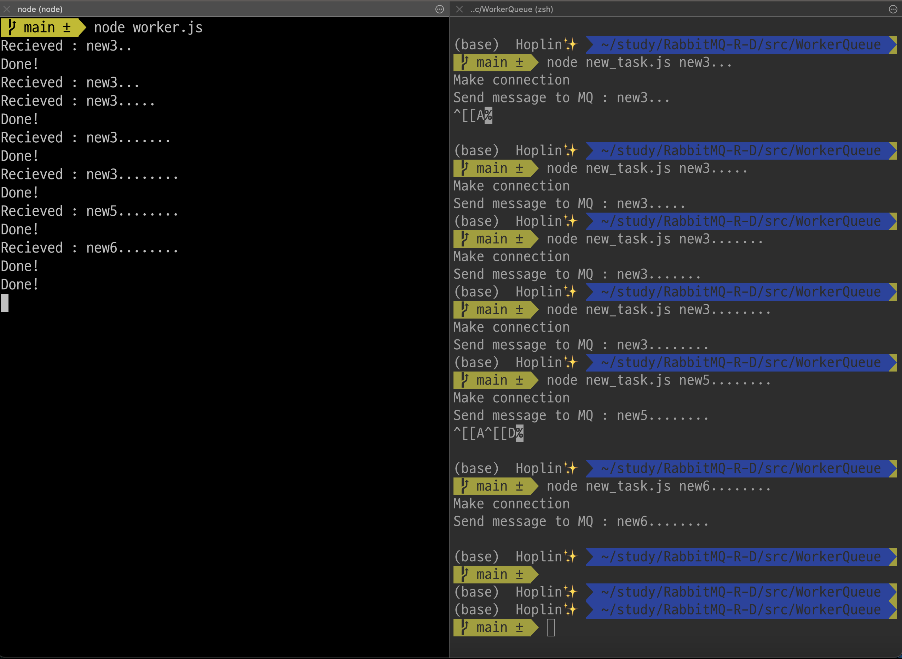

이를 방지하기 위해서 `channel`객체에 대해 `prefetch()` 메소드를 사용하여, `worker`별로 받아서 처리할 수 있는 최대 메세지 개수를 지정할 수 있다. 매개변수로는 `worker`가 받을 수 있는 최대 메세지 개수를 건네준다. 아래 예시에서는 `worker`가 한번에 하나의 메세지만 받아서 처리할 수 있다는 의미가 된다.

```JavaScript

// worker.js

...

channel.prefetch(1);

...

```


`ACK Message`송신 여부에 따라 새로운 메세지를 전송할 수 있는지 판별하므로, `worker`의 `consume` 메소드 옵션 `{ noAck:false }`를 지정해 주어야한다. `prefetch()`메소드를 적용한 이후 위와 동일하게 실험을진행해본다.

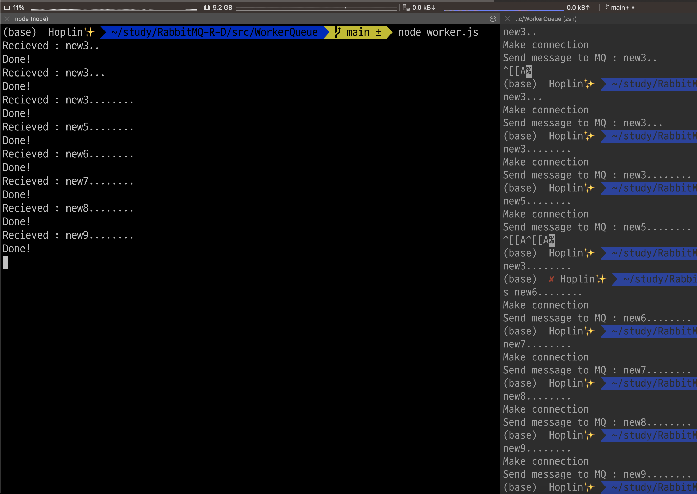

해당 예시 코드에서는 `prefetch(1)`로 적용하였다. `worker`가 메세지를 처리하는 도중 `publisher`(new_task.js)가 메세지를 보내면, `worker`에 바로 전달지 않고, `worker`의 작업이 끝나면 메세지가 전달되는것을 볼 수 있다.

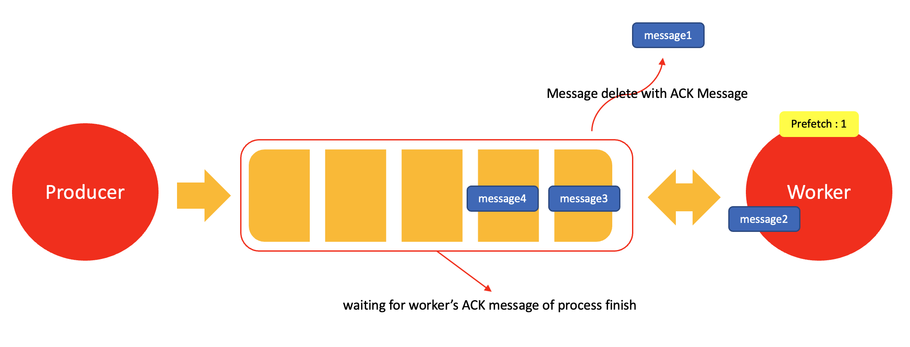