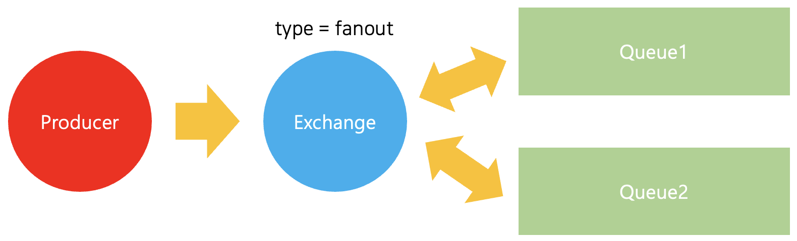

# 4. Publisher / Subscriber
***

전반적인 코드는 이 [링크](../src/PubSub/)에서 볼 수 있다.
***

## Publish / Subscribe

잎에서 우리는 `Worker Queue`라는것을 생성하였다. Worker Queue를 할때 각각의 task들은 여러개의 `Worker`가 존재하여도 하나의 `Worker`에만 task를 전송하였다. 이번장에서는 `Worker Queue`와 달리, **메세지를 여러개의 `Consuemr`에 전송하는것을 해볼 것이다. 그리고 이러한 패턴을 주로 `Publish/Subscribe`패턴이라고 부른다**.

`Publish/Subscribe` 패턴을 설명하기 위해서 간단한 logging system을 제작해 본다. 여기에는 두개의 프로그램이 포함되게 된다.

  1. 로그메세지를 방출한다 

  2. 받은 메세지를 콘솔에 출력

필수적으로 publish된 메세지들은 모든 receiver들에게 `broadcase`되어야한다.

## Exchange

기존에 보았던 개념에서는 `Queue`에 메세지를 보내고, 받아왔다. 해당 개념에서 사용되는 component들을 다시 살펴보자

  - Producer : Message를 전송한다.

  - Queue : 메세지를 저장하는 Buffer이다

  - Consumer : Message를 수신한다.

**Rabbit MQ의 기본적인 개념은 `Producer`는 `Queue`에 바로 메세지를 전송하지 않는다는것이다. [(이에 대한 개념은 뒤에 `The default exchange` 개념을 통해 살펴본다)](#default-exchange)** 대신 `Producer`는 메세지를 `Exchange`에만 보낼 수 있게된다. `Exchange`의 작동 방식은 한쪽에서는 메세지를 받고, 다른 쪽에서는 Queue에다가 메세지를 push한다. 

`Exchange`는 메세지를 특정 큐로 넣어야하는지, 여러개의 큐에 넣어야하는지, 버려야하는지와 같이 받은 메세지를 어떻게 활용해야하는지 알고 있어야한다. 그리고 이는 `Exchange Type`에 의해 규칙이 정의된다.



선택 가능한 `Exchange Type`으로는 아래와 같은것들이 있다.

  - direct : Routing Key 기반의 메세징 전달

  - topic : Routing Key 패턴 기반의 메세지를 전달한다

  - headers : Routing Key 대신 헤더에 값을 넣어 전달한다

  - fanout : 브로드 캐스트 방식,모든 큐에 메세지를 전달한다.

이중 `fanout`에 집중해본다. `logs`라는 이름을 가진 `Exchange`를 생성해보자. `Exchange`를 생성하기 위해서는 `channel`객체의 [`assertExchange`메소드](https://amqp-node.github.io/amqplib/channel_api.html#channel_assertExchange)를 사용하면 된다. 첫번째 매개변수에는 `Exchange`의 이름을, 두번째 매개변수에는 `Exchange Type`을, 세번째 매개변수에는 option을 넣어준다. option은 [Document](https://amqp-node.github.io/amqplib/channel_api.html#channel_assertExchange)를 참고한다.(assertChannel메소드와 동일하다.)

```javascript
// Create Exchange
await channel.assertExchange(process.env.EXCHANGE_NAME, 'fanout', {
  durable: false
})
```
***
### Default Exchange

앞에서 `Introduction`과 `Worker Queue`에서는 `Exchage`에 대해 인지하지 못한 상태로 `Queue`에 메세지를 보냈었다. 하지만 위에서 말했듯이 Rabbit MQ의 기본적인 개념은 `Producer`는 `Queue`에 바로 메세지를 전송하지 않는다는것이다.

이것이 가능했던 이유는 `default exchange`를 사용했기 때문이다. 그리고 `default exchange`는 빈 문자열인 `''`으로 식별된다. 앞에서 `Queue`에 메세지를 보내는 코드를 다시 살펴본다

```javascript
channel.sendToQueue(process.env.QUEUE_NAME, Buffer.from(msg))
```
위 코드에서 `Default Exchange`를 사용하는것을 알 수 있다. 메세지는 첫번째 매개변수에 지정된 이름의 `Queue`로 전송되는것이다.
***
이번에는 이름이 있는 `Exchange`에 `publish`를 진행해보자. 기존에는 `Default Exchange`를 통해 `Queue`에 바로 전송을 하였다. `Queue`에 바로 전송을 할때는 `channel.sendToQueue`메소드를 사용하였지만, `Exchange`에 연결된 `Queue`로 보내기 위해서는 `publish` 메소드를 사용해야한다. `publish`메소드를 사용할때는 `sendToQueue` 메소드와 달리, `Queue`이름을 지정 하지 않는다. 

```javascript
channel.publish('logs', '', Buffer.from('Hello world'))
```
publish를 하기 위해서는 [`channel.publish메소드`](https://amqp-node.github.io/amqplib/channel_api.html#channel_publish)를 사용한다. 첫번째 매개변수는 `Exchange` 이름을, 두번째 매개변수는 `Routing Key`, 세번째 매개변수는 메세지를 버퍼로 변환한 값이다.

`channel.publish`메소드에서 두번째 매개변수가 빈 문자열이라는것은 특정한 큐로 보내고 싶지 않다라는것을 의미한다. 단지 `logs`라는 `Exchange`에 메세지를 publish하고 싶다는 의미이다. `channel.publish`메소드의 두번째 매개변수 `Routing Key`에 대한것은 다음장 'Routing'개념을 하면서 자세히 살펴본다.

## Temporary Queues

기존에 `Queue`에 대해서 이름을 부여하였다. 만약에 `Producer`와 `Consumer`간의 `Queue`를 공유해야 한다면 `Queue`의 이름을 부여하는것은 당연하다. 하지만 해당 예시에서는 logger를 작성하는것이다. logger는 모든 메세지를 받아야한다. 또한 오래된 메세지가 아닌 가장 최신의 메세지가 필요로 하다. 이를 해결하기 위해서는 두가지 작업이 필요하다

  1. Rabbit MQ에 연결하게 되면, 새로운 빈 `Queue`가 필요하게 된다. 이를 위해서는 랜덤한 이름을 가진 `Queue`가 필요하게 된다.

  2. `Consumer`가 Rabbit MQ에서 연결을 끊게 되면, 랜덤으로 생성된 `Queue`는 삭제되어야한다.


`channel.assertQueue`메소드를 통해 `Temporary Queue`를 생성해본다.

  - `Queue`의 이름을 빈 문자열로 넘겨준다.

  - 아래 옵션을 옵션으로 설정한다
    ```
    {
      exclusive: true
    }
    ```

결과로는 랜덤으로 생성된 `Queue`의 이름이 포함된 queue instace가 반환된다. 아래와 같이 `assertQueue` 메소드를 `Subscriber`에서 실행해본다. 아래 결과에서 `queue` 프로퍼티의 값이 랜덤으로 생성된 큐의 이름이다.

```javascript
// 코드 

const qinstance = await channel.assertQueue('', {
  exclusive: true
})

console.log(qinstance);

// 결과
{
  queue: 'amq.gen-vm6aTi4TIGSxX9S4mZY_mA',
  messageCount: 0,
  consumerCount: 0
}
```

만약 선언된 연결이 종료되게 되면(Subscriber에서 선언한 connection) 랜덤으로 생성한 `Queue`는 사라지게 된다.

## Binding

Binding이란 `Exchange`와 `Queue`간의 관계를 설정하는 것이다. `Exchange`가 `Queue`에게 메세지를 보내도록 알려주어야 한다. `Binding`을 하기 위해서는 `channel.bindQueue`메소드를 활용해 주어야 한다.([Document](https://amqp-node.github.io/amqplib/channel_api.html#channel_bindQueue))

`channel.bindQueue`메소드는 세개의 parameter를 기본적으로 받는다

  - queue : `Queue` 이름

  - source : `Queue`를 Bind할 `Exchange` 이름을 의미한다

  - pattern(or 'binding key') : 주어진 패턴에 따라 이름이 지정된 대기열로 메세지를 릴레이 한다. 이 세번째 매개변수는 다음 글에서 자세하게 활용하니, 우선 넘어간다.

예시는 아래와 같이 작성할 수 있다.

```javascript
channel.bindQueue(qinstance.queue, process.env.EXCHANGE_NAME, '')
```