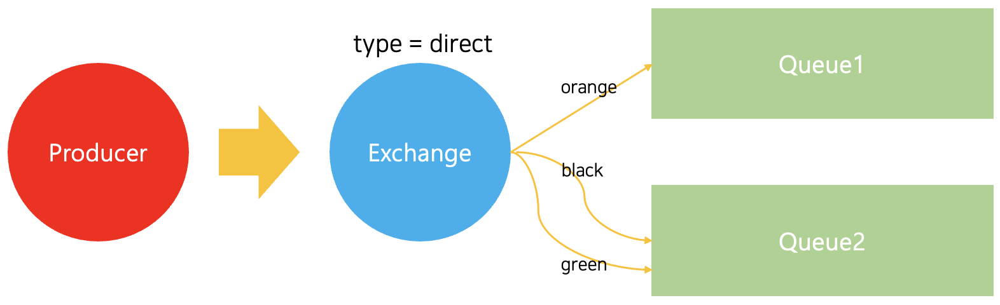

# 5. Routing
***
전반적인 코드는 이 [링크](../src/Routing/)에서 볼 수 있다.
***

## Routing

[`4. Publish/Subscribe`](./4.%20Publish%20Subscribe.md)에서는 간단한 로깅 시스템을 제작해 보았다. 해당 글에서는 `fanout` 타입의 `Exchange`를 활용하여 브로드 캐스팅 하는 방식을 사용하였다.

이번 글에서는 메세지들 중 일부분의 메세지에 대해서만 `Subscribe` 할 수 있도록 기능을 추가해 볼 것이다.

## Binding

앞에서 `Queue`를 `Exchange`에 Binding할떄 아래와 같이 코드를 작성하였었다.

```javascript
channel.bindQueue(qinstance.queue, process.env.EXCHANGE_NAME, '')
```

`Binding`은 `Queue`와 `Exchange`간의 연관관계라는 것을 앞에서 보았다. `Queue`와 `Exchange`간의 연결을 위해 `Binding`을 설정할때 **`bindQueue`메소드 세번째 매개변수에 `Binding Key Parameter`를 설정해줄 수 있다**. 

위의 코드와 같이 **`Binding Key Parameter`(앞으로는 `Binding Key`라고 부른다)를 빈 문자열로 남겨두게 되면, 모든 메세지에 대해 `Subscribe`하겠다는 의미**가 된다.

만약 `Binding Key Parameter`를 'log'로 지정하고 싶다면 아래와 같이 작성하면 된다.

```javascript
channel.bindQueue(qinstance.queue, process.env.EXCHANGE_NAME, 'log')
```
**`Binding Key` 설정은 `Exchange`의 타입에 의존**된다. 예를 들어 앞에서 보았던 `fanout` 같은 경우, `Binding Key`를 무시하고 모든 메세지를 `Broadcast`하게 된다.

## Direct Exchange
이번 글에서는 로그의 심각도(Log Level)에 따라 메세지를 `Subscribe`할 수 있는 로그 시스템을 만들어 볼 것이다.

앞에서도 언급했듯이 [`4. Publish/Subscribe`](./4.%20Publish%20Subscribe.md)에서는 모든 메세지를 `Broadcast`하는 `fanout` 타입의 `Exchange`를 사용하였다.

이 글에서 만들고자 하는 로깅 시스템을 만들위해서는 `direct` 타입의 `Exchange`를 사용한다. **메세지는 `Binding Key`가 메세지의 `Routing Key`와 동일한 큐로 전송**되게 된다.



위 예시를 보면 `direct` 타입의 `Exchange`가 선언되어있다. Queue1은 `orange` 라는 `Binding Key`로 연결이 되어있고, `Queue2`는 `black`과 `green` 이라는 `Binding Key`로 연결되어있다. 이와 같이 선언 되면, `orange`라는 `routing key`를 가지고 있는 메세지는 `Queue1`으로, `black`,`green`이라는 routing key를 가지고 있는 메세지는 `Queue2`로 전송이 되게 된다.

## Emit logs
이제 로거를 구현해 본다. 위에서 그려본 모델을 그대로 적용한다. 전송할 로그의 심각도를 `routing key`로 지정한다. 로그를 전송하는 `Exchange`를 우선 정의해본다.

```javascript
// subscriber.js

await channel.assertExchange(process.env.EXCHANGE_NAME, 'direct', {
  durable: false
})
```
그 후 `channel.publish` 메소드를 통해 메세지를 전송해본다.

